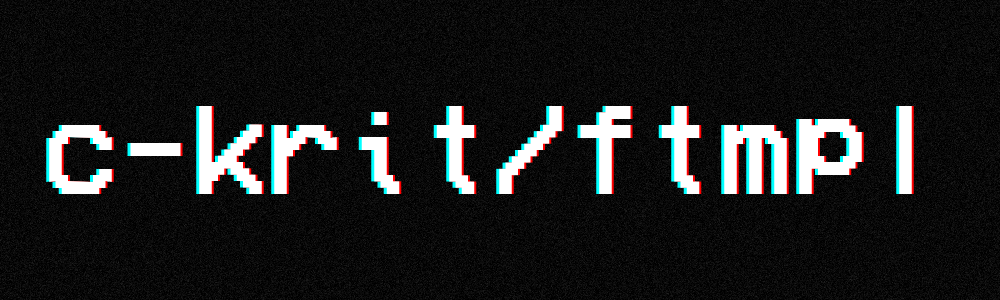
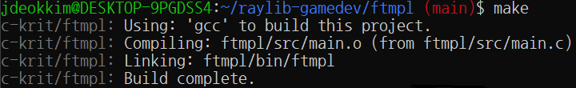

<div align="center">

<br>

[](https://github.com/c-krit/ftmpl)
[](https://github.com/c-krit/ftmpl/blob/main/LICENSE)

A small raylib template for the [ferox](https://github.com/c-krit/ferox) physics library.

</div>

## Features

<br>

- Supports compiling on GNU/Linux or Windows with [MSYS2 (MINGW64)](https://www.msys2.org/)
- Supports cross-compiling from GNU/Linux to Windows
- Supports compiling into WebAssembly
- Colored text output for `Makefile`

## Prerequisites

- GCC version 9.4.0+
- GNU Make version 4.1+
- Git version 2.17.1+

```console
$ sudo apt install build-essential git
```

## Tutorial

Clone this repository with:

```console
$ git clone --recursive -j`nproc` https://github.com/c-krit/ftmpl && cd ftmpl
```

Or you can do:

```console
$ git clone -j`nproc` https://github.com/c-krit/ftmpl && cd ftmpl
$ git submodule update --init --recursive
```

Then you need to build `raylib` and `ferox` in the `ftmpl/lib` directory.

After building the required libraries, go to the directory where `Makefile` is located, then do:

```console
$ make
```

Or if you are compiling for the Web:

```console
$ make PLATFORM=WEB
```

Or if you are cross-compiling for Windows:

```console
$ make PLATFORM=WINDOWS
```

More things you can do for your project:

- Change the values of `PROJECT_NAME` and `PROJECT_FULL_NAME` in `Makefile`
- Edit this `README.md` file, and delete the images in the `ftmpl/res` directory

## License

MIT License